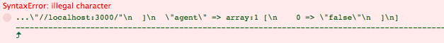

# Demo for integration of BrowserSync and DebugBar in Laravel 5

## Bug

JavaScript be halted by "SyntaxError: illegal character".



```js
" ...\"//localhost:3000/"\n ... "
```

Should be:

```js
" ...\"\/\/localhost:3000\/\"\n ... "
```

Or:

```js
" ...\"localhost:3000\"\n ... "
```

## Reproduce

Initialize a Laravel project:

```bash
laravel new bug-demo
cd bug-demo
php artisan fresh
```

Edit `package.json`:

```json
{
  "private": true,
  "devDependencies": {
    "gulp": "^3.8.11",
    "laravel-elixir": "^1.0.0",
    "laravel-elixir-browser-sync": "^0.1.6",
    "laravel-elixir-serve": "^0.1.1"
  }
}
```

Edit `gulpfile.js`:

```js
elixir(function(mix) {
    var port = 8000;
    mix.less('app.less')
        .serve({
            port: port
        })
        .browserSync(null, {
            proxy: 'localhost:' + port,
            reloadDelay: 2000
        });
});
```

Install packages:

```bash
npm install
composer require barryvdh/laravel-debugbar --dev
```

Edit `app/Providers/AppServiceProvider.php`:

```php
class AppServiceProvider extends ServiceProvider {

    // ...

    public function register()
    {
        // Add these lines:
        if ($this->app->environment() === 'local') {
            $this->app->register('Barryvdh\Debugbar\ServiceProvider');
        }
    }
}
```

Run Gulp:

```bash
./node_modules/gulp/bin/gulp.js
```

---

You can clone this repo and run:

```bash
composer install
npm install
./node_modules/gulp/bin/gulp.js
```
